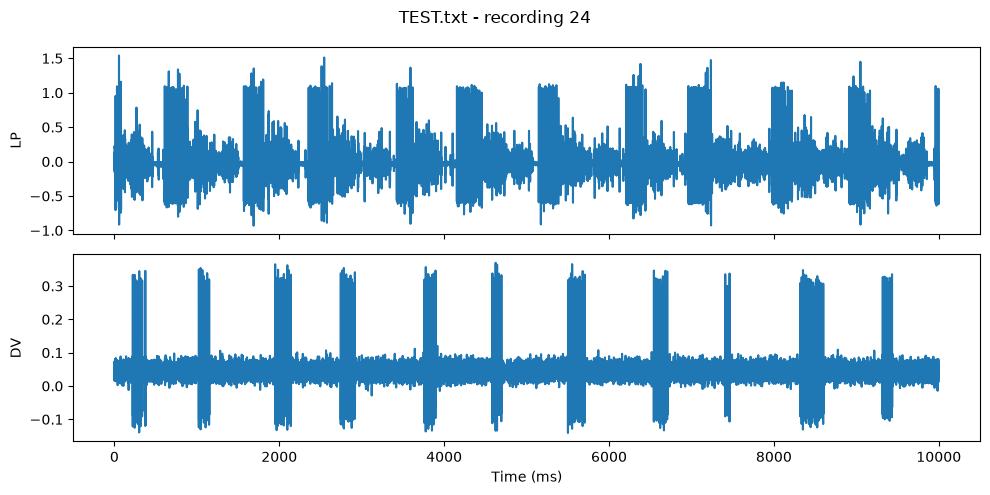
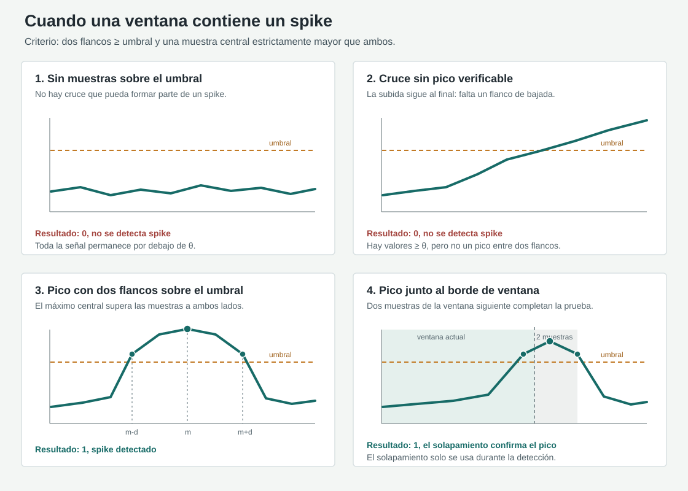

# Análisis de la información mutua entre las neuronas VD y LP del sistema nervioso estomatogástrico del cangrejo azul

## Resumen

En neurociencia, el estudio de los sistemas neuronales suele apoyarse en la teoría de la información (Shannon, 1948; Cover & Thomas, 2006) y, en particular, en el análisis de la información mutua entre las neuronas que los componen. En este informe presentamos el desarrollo experimental, el tratamiento y análisis de los datos empleados para estudiar la información mutua en el sistema nervioso estomatogástrico (STNS, por sus siglas en inglés) (Marder & Bucher, 2007) del cangrejo azul (*Callinectes sapidus*).

El STNS es un generador central de patrones (CPG, por sus siglas en inglés) (Latorre et al., 2002; Rodríguez et al., 2002), un tipo de sistema neuronal ampliamente estudiado por la regularidad de su actividad global. Los CPG generan ritmos de señales eléctricas de manera autónoma, lo que permite estudiarlos fuera del organismo. Aprovechamos esta propiedad para analizar la información mutua entre las neuronas VD y LP y comparar su actividad en tres condiciones: espontánea, durante la aplicación reiterada de un estímulo y durante la recuperación posterior, sin estímulo.

## Marco teórico

### Modelos neuronales, STNS y CPG
#### Actividad eléctrica neuronal y spikes

Las neuronas transmiten señales mediante cambios en su potencial eléctrico. Cuando estos cambios superan el umbral de excitación se producen potenciales de acción, o *spikes*, que pueden representarse por sus tiempos de ocurrencia como un tren de eventos. En un registro extracelular, la señal observada depende también de la preparación y del electrodo; por ello, el análisis de eventos requiere un criterio de detección consistente (Marder & Bucher, 2007; Strong et al., 1998).

#### Sistema nervioso estomatogástrico (STNS) del cangrejo azul

El STNS es un circuito neuronal de crustáceos que controla movimientos rítmicos del sistema digestivo. Su organización relativamente accesible y la persistencia de patrones rítmicos en preparaciones aisladas lo han convertido en un modelo para estudiar cómo las propiedades neuronales y las conexiones sinápticas producen actividad coordinada (Marder & Bucher, 2007). En este proyecto se estudian registros del STNS del cangrejo azul, *Callinectes sapidus*.

#### Generadores centrales de patrones (CPG) y neuronas VD y LP

Un generador central de patrones (CPG) es una red neuronal capaz de producir actividad rítmica sin requerir una señal rítmica externa. En el STNS, el circuito pilórico genera secuencias coordinadas de actividad en neuronas motoras. VD y LP forman parte de la actividad registrada en este circuito; sus spikes pueden organizarse en ráfagas y fases rítmicas. El análisis de intervalos entre spikes y de ráfagas ofrece descripciones complementarias de estos patrones (Latorre et al., 2002; Rodríguez et al., 2002).

### Codificación neuronal y discretización de señales
#### Codificación por eventos (spike trains) y secuencias binarias

Un tren de spikes conserva los instantes de los eventos, mientras que una secuencia binaria resume cada intervalo como presencia o ausencia de al menos un spike. Esta representación facilita comparar canales y calcular estadísticas, pero pierde información sobre la forma y amplitud de cada spike y sobre su posición exacta dentro de la ventana. La elección de la representación determina, por tanto, qué aspectos de la actividad pueden detectarse como dependencias (Strong et al., 1998; Rodríguez et al., 2002).

#### Ventana temporal Δt y palabras (n-gramas)

La duración de la ventana, Δt, fija la resolución temporal de la secuencia: ventanas pequeñas conservan mejor la localización de los eventos, mientras que ventanas grandes pueden agrupar eventos cercanos y ocultar su orden. Al agrupar símbolos binarios consecutivos en palabras de longitud N, o n-gramas, se representan patrones temporales más extensos y se pueden comparar secuencias alineadas de VD y LP. Al crecer N también aumenta el número de palabras posibles, de modo que la estimación a partir de registros finitos exige cautela (Strong et al., 1998; Paninski, 2003).

### Teoría de la información
#### Entropía de Shannon y entropía de bloque

La entropía de Shannon cuantifica la incertidumbre de una variable aleatoria: es baja cuando unos pocos resultados concentran la probabilidad y alta cuando la probabilidad está más repartida (Shannon, 1948; Cover & Thomas, 2006). La entropía de bloque aplica esta idea a secuencias de N símbolos; así incorpora tanto la variabilidad de cada símbolo como los patrones temporales que aparecen en la palabra. Su estimación empírica depende de cuántas observaciones haya para cubrir los patrones posibles (Paninski, 2003).

#### Información mutua

La información mutua cuantifica cuánto reduce la observación de una variable la incertidumbre sobre otra. Es cero cuando las variables son independientes y es simétrica: intercambiar los canales no cambia su valor. Aplicada a palabras alineadas, mide la dependencia estadística compartida entre sus patrones, pero no identifica por sí sola un mecanismo ni una dirección causal (Cover & Thomas, 2006; Rodríguez et al., 2001). 

## Diseño experimental

### Sistema biológico y preparación

El estudio se realiza sobre el sistema nervioso estomatogástrico (STNS) del cangrejo azul (Callinectes sapidus), una red de tipo CPG (generador central de patrones) que produce actividad rítmica trifásica de forma autónoma. Se trabaja in vitro: el sistema nervioso se extrae del organismo y se mantiene en una cámara de registro bajo un estereomicroscopio, con control de temperatura y sobre una mesa de aislamiento de vibraciones.

Se registra de forma extracelular en los nervios motores del STNS:

 - LVN (nervio ventricular lateral): contiene la actividad de la neurona LP, junto con PY y PD.
 - MVN (nervio ventricular medial): contiene la actividad de la neurona VD, junto con IC.
 - IVN (nervio ventricular inferior): también se registra, aunque el análisis se limita a LP y VD.

Los registros extracelulares miden la caída de potencial entre dos electrodos a lo largo de la resistencia del medio, lo que permite identificar los spikes y los bursts de cada neurona.

### Estimulación con GABA mediante microinyección

La perturbación experimental consiste en la inyección de GABA (neurotransmisor) sobre el circuito. Para ello se emplea un microinyector construido en el laboratorio, controlado electrónicamente y dirigido sobre la preparación. El control en tiempo real se realiza con un sistema de sinapsis artificiales y estimulación en tiempo real, que permite que la inyección dependa de la propia actividad de la red.

La inyección se dispara a partir de los bursts de la neurona VD (trigger), aplicando la inyección durante 0.4ms apartir del cuarto spike dek burst. Estableciendo un lazo cerrado entre actividad y estimulación.

### Protocolo temporal

Cada experimento se divide en tres fases, que se corresponden con las condiciones del proyecto:

 1. Control (actividad espontánea): 1 minuto.
 2. GABA (estimulación repetida): 2 minutos de inyección.
 3. Recuperación: 3 minutos de registro posterior.

Tras cada experimento se deja un periodo de 10 minutos para la recuperación total de la preparación antes de repetir el protocolo con otra modalidad. Los ficheros de datos del repositorio (TrozoC, TrozoG, TrozoR) corresponden a estas tres fases: control, GABA y recuperación, agrupados en cadenas por condición.

## Tratamiento de datos

El objetivo del tratamiento de los datos es transformar las señales, originalmente pseudocontinuas, en representaciones discretas que permitan calcular la entropía y la información mutua entre canales. Para ello, se aplican dos técnicas de discretización que extraen características distintas de las señales.

El primer método, la detección de eventos, parte de la hipótesis de que la información relevante está contenida en los spikes. En las secciones siguientes describimos cómo se identifican. De forma intuitiva, el método divide cada registro en ventanas de tiempo fijas y representa cada ventana con un valor binario: 1 si contiene un spike y 0 si no lo contiene.

> Pendiente: describir el segundo método de discretización.

La discretización permite construir n-gramas para calcular la entropía y la información mutua. El análisis se centra en la evolución de la entropía de bloque de cada canal y de la información mutua entre VD y LP, por separado para las tres fuentes de datos, a medida que aumenta la longitud de los n-gramas.

### Descripción de los datos

Para cada condición del esperimento se obtienen dos canales simultáneos, LP y VD, con trenes de spikes agrupados en bursts rítmicos claramente identificables. Las señales se muestrean a 0,1 ms por muestra y se segmentan en grabaciones de 100 000 muestras para el análisis, como se puede ver en la imagen.

### Umbral de detección de spikes

Como se observa en la imagen, los spikes corresponden a variaciones extremas del potencial eléctrico respecto de la actividad habitual del canal. Por tanto, es posible distinguirlos mediante un umbral que identifique los valores asociados a estos eventos. Un umbral adecuado debe considerar tanto el comportamiento general de la señal como sus valores extremos. Desde el punto de vista estadístico, esto puede expresarse como una combinación de una medida de tendencia central y otra de los valores extremos.

En las pruebas realizadas, el punto medio entre la media y el máximo de cada registro, denominado `mean_max` local, separa satisfactoriamente ambas regiones. En la figura, este umbral se muestra en naranja.

Al calcular un umbral con todos los datos del canal, el máximo puede aumentar considerablemente al incorporar más registros, mientras que la media tiende a variar menos. Para limitar la influencia de valores extremos, definimos el umbral global como el punto medio entre la media de todos los datos y el menor de los máximos de cada registro:

$$
\operatorname{mean\_max}_{\mathrm{global}} = \frac{\operatorname{mean}(\mathrm{data\_source}) + \min_{i \in \mathrm{records}}\left(\max(\mathrm{record}_i)\right)}{2}.
$$

En los datos analizados, se observa que $\operatorname{mean\_max}_{\mathrm{global}} \leq \operatorname{mean\_max}_{i,\mathrm{local}}$ para casi todos los registros $i$; la línea negra de la figura muestra el umbral global. Esta relación no está garantizada en general, pues las medias locales pueden variar. Cuando se cumple, cualquier spike detectado con el umbral local también queda por encima del umbral global.

Con las siguientes tablas puedra hacer una comparación del resultado de esta redefinición del `global_mean_max`:

| Canal | Media | Máximo | `mean_max` |
|:--|--:|--:|--:|
| LP | -0.033591 | 1.540833 | 0.753621 |
| VD | 0.043612 | 0.369568 | 0.206590 |
:`Registro 24`

| Canal | Media | Máximo |`old_mean_max`| `mean_max` |
|:--|--:|--:|--:|--:|
| LP | -0.033512 | 1.665039 | 0.815764 | 0.666685 |
| VD | 0.043721 | 1.351624 | 0.697673 | 0.199626 |
:`Global`

**Nota.** `mean_max_global` es un vector con un umbral por canal de la fuente de datos. En este informe, el nombre puede referirse al vector o al umbral de un canal concreto; el contexto permite distinguir ambos casos.

### Ventana temporal para la discretización

> Pendiente: obtención de la ventana temporal optima.

### Registro de eventos (spikes)

Una vez definida la ventana temporal, cada registro se divide en ventanas y se etiqueta cada una con un valor binario. Sin embargo, que una ventana contenga muestras por encima del umbral no basta para declararla como spike: puede contener solo el flanco ascendente o descendente de un evento.

Para caracterizar un spike, el detector busca tres muestras de tal manera que dos de ellas igualen o superen el umbral y una muestra central estrictamente mayor que ambos. Si para el análisis concideramos la función de potencial como una función continua, estas condiciones nos garantizan que la funcion es concava en el sub-intervalo de las muestras, ademas garantiza que en el mismo intervalo deben existir valores simetricos y por el teorema de Rolle un maximo local, no necesariemente la muestra central. En otras palabras, para algún desplazamiento $d > 0$ y una posición central $m$, se requiere que

$$
x[m-d] \geq \theta, \qquad x[m+d] \geq \theta, \qquad
x[m] > \max\bigl(x[m-d], x[m+d]\bigr),
$$

donde $x$ es la señal y $\theta$ el umbral del canal. La muestra central representa la concavidad; las otras dos confirman que la señal aciende y deciende dentro de la ventana. Basta con que exista un triplete que cumpla estas condiciones para etiquetar la ventana como spike. Por ello, una subida que continúa hasta el final de la ventana no se acepta: todavía no hay un flanco de bajada que permita verificar el pico.

En el borde entre ventanas, el detector añade las dos primeras muestras de la ventana siguiente al análisis de la ventana actual. Este solapamiento se usa solo para decidir si hay un spike, no modifica el tamaño de las ventanas ni la secuencia binaria resultante. Permite verificar un pico cuyo flanco de bajada cae justo después del límite, evitando perderlo por el corte temporal.

Esta verificación es importante porque la discretización convierte la señal en una secuencia de presencia/ausencia de spikes. Si cualquier cruce del umbral se contara como evento, fragmentos de spikes sin pico producirían falsos positivos. Estos alterarían las frecuencias de los n-gramas y, por tanto, las estimaciones de entropía e información mutua.

### N-gramas e información mutua

El análisis de detección de eventos parte de la hipótesis de que el ritmo del generador central de patrones (CPG) se establece mediante la comunicación entre las neuronas del STNS, en la que participan VD y LP. Una representación binaria de cada ventana conserva si hubo o no un spike, pero no describe el orden de los eventos ni posibles dependencias temporales. Para estudiar esos patrones, agrupamos símbolos consecutivos en palabras de longitud $N$, también llamadas $N$-gramas.

Sea $X^N$ la palabra de VD y $Y^N$ la palabra de LP observadas en el mismo conjunto de $N$ ventanas consecutivas. Para una longitud fija $N$, estimamos sus probabilidades a partir de las frecuencias relativas en todas las posiciones válidas del registro. Si el registro discretizado tiene longitud $T$, hay $T-N+1$ palabras posibles por canal. Definimos el conteo conjunto como

$$
C_N(x_N,y_N) = \sum_{t=1}^{T-N+1}
  \mathbb{1}\!\left[x_N^{(t)}=x_N \,\wedge\, y_N^{(t)}=y_N\right],
$$

de modo que

$$
\hat{p}_N(x_N,y_N) = \frac{C_N(x_N,y_N)}{T-N+1}, \qquad
\hat{p}_N(x_N) = \sum_{y_N}\hat{p}_N(x_N,y_N), \qquad
\hat{p}_N(y_N) = \sum_{x_N}\hat{p}_N(x_N,y_N).
$$

Estas frecuencias relativas son estimaciones empíricas de las probabilidades; al sustituirlas en la definición de información mutua obtenemos el estimador de frecuencias:

Para cada canal, la entropía de las palabras de longitud $N$ es

$$
H_N(X) = -\sum_{x_N} \hat{p}_N(x_N)\log_2\hat{p}_N(x_N).
$$

Así, las etiquetas describen la longitud configurada `word_length = N`. La suma se toma sobre las palabras observadas con probabilidad conjunta positiva. Las palabras se construyen sincronizadamente en ambos canales:

$$
x_N^{(t)} = \left(x_t,\,x_{t+1},\,\dots,\,x_{t+N-1}\right), \qquad
y_N^{(t)} = \left(y_t,\,y_{t+1},\,\dots,\,y_{t+N-1}\right)
$$

Aprovechando el calculo de las entropias reducimos la estimación de la información mutua usando la siguiente identidad: 

$$
\hat{I}_N(VD,LP) = H_N(X) + H_N(Y) - H_N(X,Y)
$$

Estas cantidades dependen también de la duración de la ventana temporal, $\Delta t$, pues esta determina la discretización de los datos. Para destacar esta dependencia podríamos escribir $H_N(X;\Delta t)$ y $\hat{I}_N(VD,LP;\Delta t)$, pero omitiremos $\Delta t$ en la notación general para mantener las expresiones sencillas. En los resultados analizaremos cómo varía la información mutua al cambiar este parámetro. Al estar alineadas las palabras, la información mutua es simétrica: $\hat{I}_N(VD,LP)=\hat{I}_N(LP,VD)$.

Como las entropías marginales y la información mutua se calculan a partir de las mismas palabras de longitud $N$, se cumple $0 \leq \hat{I}_N(VD,LP) \leq \min(H_N(VD), H_N(LP))$.

En términos de las distribuciones verdaderas, la información mutua de las palabras no disminuye al aumentar $N$. En efecto, $X^N$ y $Y^N$ se obtienen como prefijos de $X^{N+1}$ y $Y^{N+1}$; añadir variables a cualquiera de los dos vectores no puede reducir la información mutua. Por tanto,

$$
I_{N+1}(VD,LP) \geq I_N(VD,LP).
$$

La desigualdad puede ser una igualdad si los símbolos añadidos no aportan información nueva. Esta propiedad se refiere a las distribuciones verdaderas. En un registro finito, las frecuencias se vuelven a calcular para cada longitud y el número de posiciones válidas disminuye de $T-N+1$ a $T-N$; por variabilidad muestral, el estimador $\hat{I}_N$ no tiene por qué crecer en cada paso. Además, al aumentar $N$ crece rápidamente el número de palabras posibles, por lo que algunas aparecen pocas veces o no aparecen; las estimaciones para longitudes grandes deben interpretarse con cautela.

Para interpretar la información mutua como una medida de transferencia relativa, normalizamos respecto de la entropía del canal que se considera estímulo. Si VD se toma como estímulo de LP, usamos

$$
E_{VD\to LP}^{(N)} = \frac{\hat{I}_N(VD,LP)}{H_N(VD)},
$$

que representa la fracción de la entropía de VD compartida con LP. Si LP se considera el estímulo de VD, la normalización correspondiente es

$$
E_{LP\to VD}^{(N)} = \frac{\hat{I}_N(VD,LP)}{H_N(LP)}.
$$

Aunque la información mutua es simétrica, estas dos cantidades normalizadas pueden diferir porque usan entropías marginales distintas. Describen información compartida relativa; por sí solas no demuestran una relación causal ni estiman una transferencia dirigida entre las neuronas.

### Segunda discretización

### Segunda estimación de la información mutua

## Resultados

## Referencias

Cover, T. M., & Thomas, J. A. (2006). *Elements of information theory* (2nd ed.). Wiley. https://doi.org/10.1002/047174882X

Latorre, R., Rodríguez, F. B., & Varona, P. (2002). Characterization of triphasic rhythms in central pattern generators (I): Interspike interval analysis. In *Artificial neural networks—ICANN 2002* (Lecture Notes in Computer Science, Vol. 2415, pp. 160–166). Springer. https://doi.org/10.1007/3-540-46084-5_27

Marder, E., & Bucher, D. (2007). Understanding circuit dynamics using the stomatogastric nervous system of lobsters and crabs. *Annual Review of Physiology, 69*, 291–316. https://doi.org/10.1146/annurev.physiol.69.031905.161516

Paninski, L. (2003). Estimation of entropy and mutual information. *Neural Computation, 15*(6), 1191–1253. https://doi.org/10.1162/089976603321780272

Rodríguez, F. B., Latorre, R., & Varona, P. (2002). Characterization of triphasic rhythms in central pattern generators (II): Burst information analysis. In *Artificial neural networks—ICANN 2002* (Lecture Notes in Computer Science, Vol. 2415, pp. 167–173). Springer. https://doi.org/10.1007/3-540-46084-5_28

Rodríguez, F. B., Varona, P., Huerta, R., Rabinovich, M. I., & Abarbanel, H. D. I. (2001). Richer network dynamics of intrinsically non-regular neurons measured through mutual information. In *Connectionist models of neurons, learning processes, and artificial intelligence* (Lecture Notes in Computer Science, Vol. 2084, pp. 490–497). Springer. https://doi.org/10.1007/3-540-45720-8_58

Shannon, C. E. (1948). A mathematical theory of communication. *The Bell System Technical Journal, 27*(3), 379–423; *27*(4), 623–656. https://doi.org/10.1002/j.1538-7305.1948.tb01338.x

Strong, S. P., Koberle, R., de Ruyter van Steveninck, R. R., & Bialek, W. (1998). Entropy and information in neural spike trains. *Physical Review Letters, 80*(1), 197–200. https://doi.org/10.1103/PhysRevLett.80.197